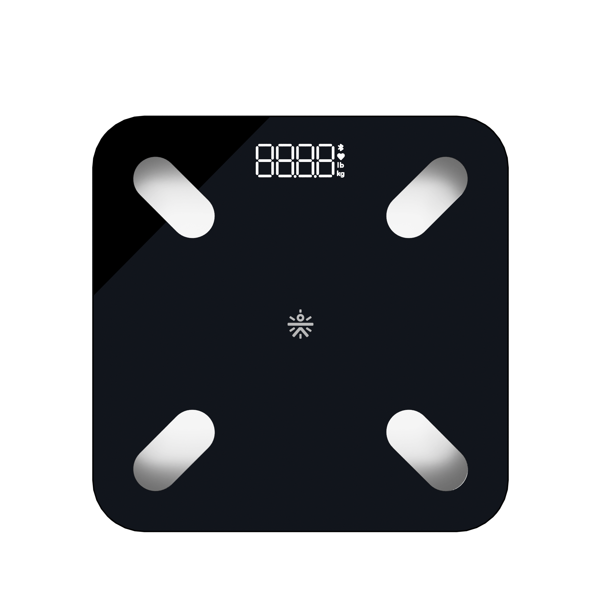

# Cult Smart Scale — Home Assistant Custom Integration

[](https://github.com/sharn25/Cult-Smart-Scale/actions/workflows/validate.yaml)
[](https://github.com/hacs/default)
[](https://opensource.org/licenses/MIT)
[](https://www.home-assistant.io/)

A native Home Assistant custom integration and BLE health tracker for the **Cult Smart Scale**.

Seamlessly captures real-time weight, stabilized weight, bioelectrical impedance (BIA), heart rate (BPM), and battery level via local Bluetooth or remote **ESP32 Bluetooth Proxies** (ESPHome) over Wi-Fi.

<p align="center">
  
</p>

---

## ✨ Key Features

- 📶 **Native BLE & ESP32 Bluetooth Proxy Support**: Works out of the box with Home Assistant Bluetooth and remote ESP32 Bluetooth Proxies (ESPHome) via high-performance `bleak-retry-connector`.
- 🔍 **Zero-Config Auto Discovery**: Automatically discovers nearby scales via Bluetooth and allows 1-click configuration in the Home Assistant UI.
- 👤 **Household Multi-Profile Support**: Link members directly to their Home Assistant `person.*` entities with automatic height, age, and gender tracking.
- 🧮 **Full 14+ Body Composition Calculations**:
  - Weight (kg) & Body Mass Index (BMI kg/m²)
  - Body Fat Percentage (%) & Body Fat Mass (kg)
  - Fat-Free Mass / Lean Body Weight (kg)
  - Muscle Mass (kg) & Muscle Rate (%)
  - Skeletal Muscle Mass (kg)
  - Total Body Water (%) & Water Mass (kg)
  - Bone Mass (kg)
  - Protein Percentage (%) & Protein Mass (kg)
  - Subcutaneous Fat (%)
  - Visceral Fat Level (Scale 1–30)
  - Basal Metabolic Rate (BMR kcal/day)
  - Metabolic Body Age (years)
  - Ideal Weight (kg) & Body Type Classification
  - Heart Rate (BPM) & Scale Battery (%)
- ⚖️ **Smart Dual Logging & Matching Modes**:
  - **Automatic Mode**: Automatically identifies the user by matching weigh-ins within configurable Weight ($\pm\text{kg}$) and Bioimpedance ($\pm\Omega$) threshold windows.
  - **Manual / Notification Mode**: Holds unassigned/guest readings in a pending buffer and triggers actionable mobile notifications to assign or discard.
- 🎨 **Dedicated Cult Scale Lovelace Card (`cult-scale-card.js`)**: Semicircular curved BIA arc gauge with animated marker bead, user profile pill bar, and colored metric grid tiles.
- ❤️ **Apple Health (HealthKit) 1-Tap Sync**: Included iOS Shortcuts guide to automatically sync your weigh-ins into Apple Health.

---

## 📦 Installation

### Method 1: Via HACS (Recommended)

1. Ensure [HACS](https://hacs.xyz/) is installed in Home Assistant.
2. In HACS, click the **3 dots in the top-right corner** $\rightarrow$ **Custom repositories**.
3. Add repository URL: `https://github.com/sharn25/cult_smart_scale`
4. Category: **Integration**.
5. Click **Download** and restart Home Assistant.

---

### Method 2: Manual Installation

1. Download or clone this repository.
2. Copy the `custom_components/cult_smart_scale` directory to your Home Assistant `custom_components/` folder:
   ```text
   homeassistant/
   └── custom_components/
        └── cult_smart_scale/
            ├── __init__.py
            ├── body_metrics.py
            ├── config_flow.py
            ├── const.py
            ├── coordinator.py
            ├── brand/
            │   ├── icon.png
            │   └── logo.png
            ├── icons.json
            ├── manifest.json
            ├── sensor.py
            ├── services.yaml
            └── translations/
                └── en.json
   ```
3. Restart Home Assistant (**Settings** $\rightarrow$ **System** $\rightarrow$ **Restart**).

---

## ⚙️ Configuration & Setup

### Step 1: Add the Scale Integration
1. In Home Assistant, go to **Settings** $\rightarrow$ **Devices & Services** $\rightarrow$ **Add Integration**.
2. Search for **Cult Smart Scale** (or click **Configure** if auto-discovered).
3. Select your scale or enter its Bluetooth MAC address.
4. Select your preferred default logging mode (**Automatic** or **Manual**).

### Step 2: Add Household Person Profiles
1. On the Cult Smart Scale integration card, click **Configure / Options**.
2. Select **➕ Add New Person Profile**.
3. Configure your member parameters:
   - **Member Name**: e.g., `<person_name>`
   - **Linked HA Person**: `person.<name>` (auto-fetches height and birthdate if available)
   - **Height**: Height in cm (e.g., `175.0`)
   - **Age**: Age in years (e.g., `30`)
   - **Gender**: Male / Female
   - **Expected Baseline Weight**: e.g., `70.0 kg`
   - **Weight Tolerance Window**: $\pm 3.5\text{ kg}$
   - **Target Impedance (Optional)**: e.g., `488 \Omega` ($\pm 60\ \Omega$)
   - **Athlete Mode**: Toggle for high-intensity athletes.
4. Click **Save**. Home Assistant will automatically create a full set of 18 sensor entities for that person!

---

## 🎨 Cult Scale Dashboard Card (`cult-scale-card.js`)

A dedicated Lovelace custom card designed specifically for the Cult Smart Scale.

### Adding the Card:
1. Copy [`cult-scale-card.js`](cult-scale-card.js) to your Home Assistant `/config/www/` folder.
2. In Home Assistant, go to **Settings** $\rightarrow$ **Dashboards** $\rightarrow$ **3 dots (top right)** $\rightarrow$ **Resources** $\rightarrow$ **Add Resource**:
   - **URL**: `/local/cult-scale-card.js`
   - **Resource type**: `JavaScript Module`
3. Add the card to your dashboard via YAML:

```yaml
type: custom:cult-scale-card
name: "Cult Smart Scale"
person_prefix: "sensor.cult_scale_<person_name>"
show_metrics_grid: true
show_profile_footer: true
```

---

## 📊 Sensor Entities

### Device Hardware Sensors:
| Sensor | Entity ID | Unit | Description |
| :--- | :--- | :--- | :--- |
| **Battery** | `sensor.cult_smart_scale_battery` | `%` | Scale battery level |
| **Last Weight** | `sensor.cult_smart_scale_last_weight` | `kg` | Last recorded raw weight |
| **Last Impedance** | `sensor.cult_smart_scale_last_impedance` | `Ω` | Last recorded raw BIA impedance |
| **Last Heart Rate** | `sensor.cult_smart_scale_last_heart_rate` | `bpm` | Last recorded heart rate |
| **Last User** | `sensor.cult_smart_scale_last_user` | — | Name of matched member |
| **Unassigned Weight** | `sensor.cult_smart_scale_unassigned_weight` | `kg` | Pending unassigned reading |

### Member Sensors (Created per configured profile):
| Sensor | Entity ID Example | Unit | Description |
| :--- | :--- | :--- | :--- |
| **Weight** | `sensor.cult_scale_<person_name>_weight` | `kg` | Stabilized weight |
| **BMI** | `sensor.cult_scale_<person_name>_bmi` | `kg/m²` | Body Mass Index |
| **Body Fat** | `sensor.cult_scale_<person_name>_body_fat` | `%` | Body fat percentage |
| **Body Fat Mass** | `sensor.cult_scale_<person_name>_body_fat_mass` | `kg` | Total body fat in kg |
| **Fat-Free Mass** | `sensor.cult_scale_<person_name>_fat_free_mass` | `kg` | Lean body mass in kg |
| **Muscle Mass** | `sensor.cult_scale_<person_name>_muscle_mass` | `kg` | Total muscle mass |
| **Muscle Rate** | `sensor.cult_scale_<person_name>_muscle_rate` | `%` | Muscle percentage |
| **Skeletal Muscle** | `sensor.cult_scale_<person_name>_skeletal_muscle` | `kg` | Skeletal muscle mass |
| **Body Water** | `sensor.cult_scale_<person_name>_total_body_water` | `%` | Hydration percentage |
| **Water Mass** | `sensor.cult_scale_<person_name>_water_mass` | `kg` | Total body water in kg |
| **Bone Mass** | `sensor.cult_scale_<person_name>_bone_mass` | `kg` | Bone mineral content in kg |
| **Protein** | `sensor.cult_scale_<person_name>_protein` | `%` | Protein percentage |
| **Subcutaneous Fat** | `sensor.cult_scale_<person_name>_subcutaneous_fat` | `%` | Subcutaneous fat % |
| **Visceral Fat Level** | `sensor.cult_scale_<person_name>_visceral_fat_level` | — | Internal abdominal fat (1–30) |
| **BMR** | `sensor.cult_scale_<person_name>_basal_metabolic_rate` | `kcal` | Resting calorie burn / day |
| **Metabolic Age** | `sensor.cult_scale_<person_name>_metabolic_body_age` | `years` | Biological fitness age |
| **Ideal Weight** | `sensor.cult_scale_<person_name>_ideal_weight` | `kg` | Target ideal weight |
| **Body Type** | `sensor.cult_scale_<person_name>_body_classification` | — | Body classification |
| **Heart Rate** | `sensor.cult_scale_<person_name>_heart_rate` | `bpm` | Resting heart rate |

---

## 🛠️ Custom Services

### `cult_smart_scale.assign_reading`
Manually assigns the latest scale measurement (weight, impedance, and heart rate) to a specific person profile, recalculating all 14+ metrics for that member.

```yaml
service: cult_smart_scale.assign_reading
data:
  user_id: "person.<name>"  # or member name
```

---

## 🔔 Automations & Apple Health Sync

- **Actionable Mobile Notification Automations**: See [`AUTOMATIONS.md`](AUTOMATIONS.md) for ready-to-use YAML automations to claim or discard guest weigh-ins.
---

## 📄 License

MIT License — see [LICENSE](LICENSE) for details.
